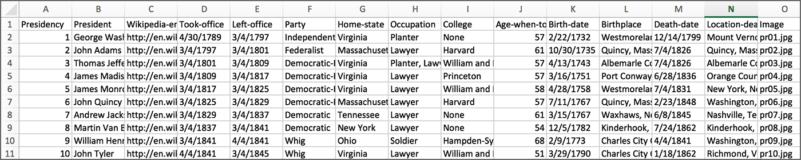

CSV Files
=========

This section is based in part on chapter 16 in Sweigart’s `Automate the Boring Stuff with Python <https://automatetheboringstuff.com/>`_ (second edition).

- `Python scripts for this section <https://github.com/macloo/python-adv-web-apps/tree/master/python_code_examples/csvs>`_

- `Python documentation for CSVs <https://docs.python.org/3/library/csv.html>`_

Introduction to CSV files
-------------------------

CSV stands for comma-separated values. A CSV file can be opened in Google Sheets or Excel and will be formatted as a spreadsheet. However, a CSV file is actually a plain-text file. It can also be opened with a text editor program such as Atom.

CSVs give us a good, simple way to organize data without using a database program. It's easy to read from and write to CSV files with Python.

The csv module in Python
------------------------

This is a built-in module, so you do not need to install it, However, you must import it in any script that uses it. ::

    import csv

After the import, you can use any of the methods that are part of the module: ::

    csv.reader()
    csv.writer()
    csv.DictReader()
    csv.DictWriter()

Note that using methods from the ``csv`` module will also involve use of Python's file handling functions, such as ``.open()``. These are covered in `Reading and Writing Files <working_with_files.html>`_ here.

Writing to a CSV
----------------

This creates a new CSV file and fills it, row by row.

.. literalinclude:: ../python_code_examples/csvs/write_csv.py
   :caption:
   :linenos:

Note that lines 13–25 above would normally be replaced by a for-loop that incorporates a **function** that creates one row to be written to the CSV.

That function might be scraping hundreds of web pages one at a time, for example. In that case, what is scraped from one page is written as one row in the CSV.

Note the steps required:

1. Import the module.
2. Open a file for writing.
3. Create a CSV writer object and assign it to a new variable.
4. Write the header row into the CSV.
5. Write all the other rows into the CSV. Normally this will involve a for-loop.
6. Close the file.

Reading from a CSV
------------------

The following example script uses a CSV file named *presidents.csv.* It contains 46 rows: one row for each U.S. president, plus a header row at the top.

The script opens the CSV and then can get all rows from it.

*Above, the top rows of the CSV file as seen in Excel.*

.. literalinclude:: ../python_code_examples/csvs/read_csv.py
   :caption:
   :linenos:

Note that in line 13 above, ``row`` is a Python list, and so we can use list indexes to get only the second item — ``row[1]`` — and the sixth item — ``row[5]``. When we use ``csv.reader()``, *each row* from the CSV file is a Python **list** of **strings.**

The code above will print 46 lines, starting like this:

.. figure:: _static/images/pres_csv_print.png
  :scale: 50 %
  :alt: result of code screenshot

Note the steps required:

1. Import the module.
2. Open a file for reading.
3. Create a CSV reader object and assign it to a new variable.
4. Use a for-loop to read from all rows in the CSV.
5. Close the file.

Reading into a dictionary
-------------------------

Typically the ``csv.DictReader()`` method is used to convert a CSV file to a Python dictionary. You *read from* an existing CSV and create a Python dictionary from it. Note, the CSV file is *unchanged,* and the dictionary does not exist as a separate file.

.. literalinclude:: ../python_code_examples/csvs/dictreader_ex.py
   :caption:
   :linenos:

The key difference between this and the previous script here is in line 13: You can access data from the CSV using dictionary keys *instead of* list indexes. For working with a CSV with a lot of columns, this is really nice!

You can read generally about Python dictionaries here: `Dictionaries <dicts.html>`_

See also: `Converting a CSV to a dictionary <dicts.html#converting-a-csv-to-a-dictionary>`_

Writing from a dictionary
-------------------------

The ``csv.DictWriter()`` method will write to a CSV file using rows of data that are *already* formatted as dictionaries.

If your data is already a list of dictionaries, as in the following example, you can use ``csv.DictWriter()`` to write to a normal CSV.

.. literalinclude:: ../python_code_examples/csvs/dictwriter_ex.py
   :caption:
   :linenos:

JSON formatted data
-------------------

Sweigart covers this in chapter 16 in `Automate the Boring Stuff with Python <https://automatetheboringstuff.com/>`_ (second edition).

.
