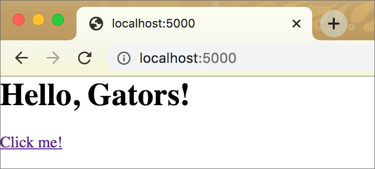
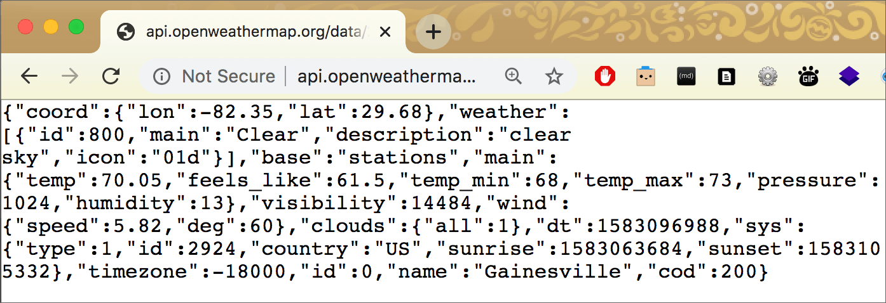
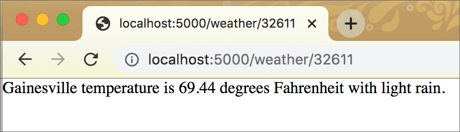
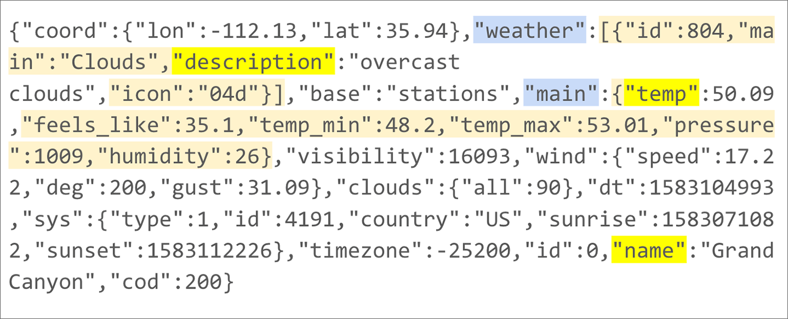

Flask, Part 2
=============

In the `Flask intro <flask.html>`_, you saw a very simple Flask app in action. Let’s step it up a little.

Code for this chapter is `here <https://github.com/macloo/python-adv-web-apps/tree/master/python_code_examples/flask>`_.

Your second Flask app
---------------------

The following script demonstrates the use of a *variable* in a Flask **route.** The function can employ the *value* of this variable in many ways. Here, the value will simply appear in the browser window as part of a string.

.. literalinclude:: ../python_code_examples/flask/hello3.py
   :caption:
   :linenos:

We have **two routes** in the script. The first route, for ``'/'``, is not very different from our first Flask app. The second route, for ``'/user/<name>'``, is doing something new.

.. note:: Because of the final two lines in this script, you will run this file in exactly the same way you’ve run every other ``.py`` file in a virtual environment: ::

        python hello3.py

    Do not use ``flask run`` to run this script. That is not necessary, thanks to lines 20 and 21.

When we go to ``localhost:5000`` in the browser, the following code from the Python script creates a functional link in the browser window: ::

    
<a href="user/Albert">Click me!</a>

When you click the link, the second route in *hello3.py* is called. That is, the relative URL *user/Albert* is sent to the server as an HTTP request. But note — and this is a *key point* — the relative URL in the HTML is ``href="user/Albert"`` and yet the Flask route says: ::

    @app.route('/user/<name>')

.. figure:: _static/images/hello3_b.png
   :scale: 50 %
   :alt: The second route in a browser screenshot

What you should understand about Flask *right now* is that we are able to pass in **changeable values** using the URL.

To test this, **change the text** that comes after ``/user/`` in the browser address bar, and press Enter or Return.

.. figure:: _static/images/hello3_c.png
   :scale: 50 %
   :alt: A variation on the second route in a browser screenshot

Look at the URL in the browser address bar, and look at the text in the browser window.

If you enter the URL *without* a value for ``name`` — e.g. ``localhost:5000/user/`` — you’ll get an HTTP error: “The requested URL was not found on the server.”

Review the route function that makes it happen: ::

    @app.route('/user/<name>')
    def user(name):
        personal = f'<h1>Hello, {name}!</h1>'
        # above - the curly braces {} hold a variable; when this runs,
        # the value will replace the braces and the variable name
        instruc = '
Change the name in the <em>browser address bar</em> \
            and reload the page.
'
        return personal + instruc

.. note:: Possibly the use of string formatters above is new to you. They are similar to template literals in JavaScript. ::

        personal = f'<h1>Hello, {name}!</h1>'

    The result of that line is equivalent to this string concatenation: ::

        personal = '<h1>Hello, ' + name + '!</h1>'

    `Learn about Python format strings here. <https://realpython.com/python-f-strings/>`_

Putting this to work with an API
--------------------------------

The next script will demonstrate how Flask can be used to send an API request, and then use the response in a formatted string. This is more useful than the previous example script — but **the same idea** of the **variable** in the **route** is used.

In the previous script, we used ``<name>`` in the route and ``name`` in the function to write *Albert* and then *Mindy.* In the **next** script, we will use ``<zip>`` in the route and ``zip`` in the function to submit a U.S. zip code to the OpenWeather API (the **request**). The **response** (in the browser) will tell us the current weather at that location.

The OpenWeather API
+++++++++++++++++++

To use this script for yourself, you will need to get an API key at `OpenWeather <https://openweathermap.org/>`_ (it’s free). Do not allow your API key to be seen by others. I am not sharing my real API key here.

.. note:: See the `configparser chapter <configparser.html>`_ for details about using a ``.cfg`` file to store all your API keys. You don’t need to do this to make the script below work, but make sure you do not *publish* that version with your actual API key in the code, e.g. on GitHub.

`Here is everything you need to know about the OpenWeather API. <https://openweathermap.org/current>`_

We will use the OpenWeather zip code query. A request to an API can be submitted in a web browser. This is the request, or query (not using a real API key): ::

    http://api.openweathermap.org/data/2.5/weather?zip=32611,us&mode=json&units=imperial&appid=12345abcXYZ

In the URL above, you can see I submitted the zip code 32611, JSON as the mode (for the response), and imperial (for temperature in Fahrenheit). The pattern of the URL is shown on the OpenWeather API page.

This is the response from the OpenWeather API, in a browser:

Like most APIs, the OpenWeather API returns a response in a **JSON-formatted string.** (You can opt to get it in other formats.) In the respnse, you can find the *name* (Gainesville), the *temp* (70.05), and the *description* (clear sky). Those **keys** and **values** will be used in the Python script *weather.py* below.

Using Flask to get a response
+++++++++++++++++++++++++++++

After creating a Flask script (*weather.py*) to query the OpenWeather API and write a more readable string into the browser, I ran the script on a February day: ::

    python weather.py

In the browser, I typed three different URLs as shown below.

The zip code 32611 is for Gainesville, Florida.

The zip code 10118 is for New York City.

.. figure:: _static/images/zip2.png
   :scale: 50 %
   :alt: Response from weather API in a browser screenshot

The zip code 99508 is for Anchorage, Alaska.

.. figure:: _static/images/zip3.png
   :scale: 50 %
   :alt: Response from weather API in a browser screenshot

The weather script
++++++++++++++++++

.. literalinclude:: ../python_code_examples/flask/weather.py
   :caption:
   :linenos:

*Line 6:* We import the ``requests`` module so that we can use ``requests.get()`` to submit the API request (on line 20).

*Line 11:* Provide **the API key** that will be used in code below this line. (Uppercase letters are used for the variable name to denote a constant; see `PEP 8 <https://www.python.org/dev/peps/pep-0008/#constants>`_).

*Line 14:* The API call — the URL for the request. Note how **curly braces** are used at two locations in this string: ``zip={},us`` and ``appid={}``. The curly braces allow a variable or a value to be inserted (on line 20).

*Line 16:* The start of a function that *is not* a Flask route function. This just provides a simple way to make the API request and return the response — *separately* from the route. The zip code will be supplied when this function is called.

*Line 20:* Using the variables ``API_URL`` and ``API_KEY`` (from lines 14 and 11), as well as the submitted zip code (covered below), the API request is constructed — ``API_URL.format(zip, API_KEY)`` — and passed into ``requests.get()``. Tacking ``.json()`` on the end will raise an exception if JSON decoding fails (`details <https://2.python-requests.org/en/master/user/quickstart/#json-response-content>`_). ::

    data = requests.get(API_URL.format(zip, API_KEY)).json()

For details on this use of ``.format()`` to plug values into the curly braces in ``API_URL``, `see this post <https://www.geeksforgeeks.org/python-format-function/>`_.

*Line 26:* The Flask route begins here. This script has only ONE route. When the app is running, the server accepts a URL like this: ::

    http://localhost:5000/weather/86023

If the zip code is valid, a response will be returned by the API.

*Line 29:* The function ``query_api()`` is called here, with the value of ``zip`` from the URL passed to it. Review that function to see that it makes the request to the API and accepts the response from the API. The result is returned and here, in the route function, is assigned to the variable ``resp``: ::

    resp = query_api(zip)

*Line 33:* Python reads the contents of ``resp`` as a **dictionary.** There are three values we want to extract:

* the *name* (location name),
* the *temp* (current temperature, in Fahrenheit), and
* the *description* (e.g., “clear sky”). ::

    text = resp["name"] + " temperature is " + str(resp["main"]["temp"]) + " degrees Fahrenheit with " + resp["weather"][0]["description"] + "."

We access those values using **keys** from the dictionary returned by the OpenWeather API:

* ``["name"]`` is a key in the primary dictionary.
* ``["temp"]`` is a key inside a dictionary that is the *value* of the key ``["main"]`` in the primary dictionary. We need to convert it to a *string* because the number is a *float,* and we cannot concatenate a float into a string unless we convert it to a string with ``str()``.
* ``["description"]`` is a key in the first list item inside the list that is the *value* of the key ``["weather"]`` in the primary dictionary.

Above is what *the API* returns to the browser (not using the Flask app).

If you need some help to understand Python dictionaries, see `Dictionaries <dicts.html>`_.

.. figure:: _static/images/zip4.png
   :scale: 50 %
   :alt: Response from weather API in a browser screenshot

Above is what *the Flask app* returns, as a string, to the browser. Below it the code that writes it. ::

    text = resp["name"] + " temperature is " + str(resp["main"]["temp"]) + " degrees Fahrenheit with " + resp["weather"][0]["description"] + "."

*Lines 34–35:* If for any reason the previous code throws an error, the ``except`` clause will be executed and the response in the browser will be:

.. figure:: _static/images/zip5.png
   :scale: 50 %
   :alt: Response from weather API in a browser screenshot

Summary of the Flask weather app
++++++++++++++++++++++++++++++++

The API and its request/response details might seem overwhelming if you have not worked with APIs before now.

The most important takeaways at this stage are:

1. The Flask app runs on a server.
2. When an **HTTP request** is made to a specific route *in that Flask app,* the request (delivered via a URL in the browser) is handled by the decorated function *in the app script.*
3. A value can be part of the URL if the Flask route is written to accept a value, e.g. ::

    @app.route('/weather/<zip>')

4. That is NOT the only way to write a route. The route does not need to accept a value; it is optional.
5. By default, if the app *returns* text, that text will appear in the browser window. What the route function returns is the **HTTP response.**
6. A Flask app can have one, or more than one, route.
7. A route function can call other functions.
8. A Flask app can use an external API. This is optional, not required.

.
