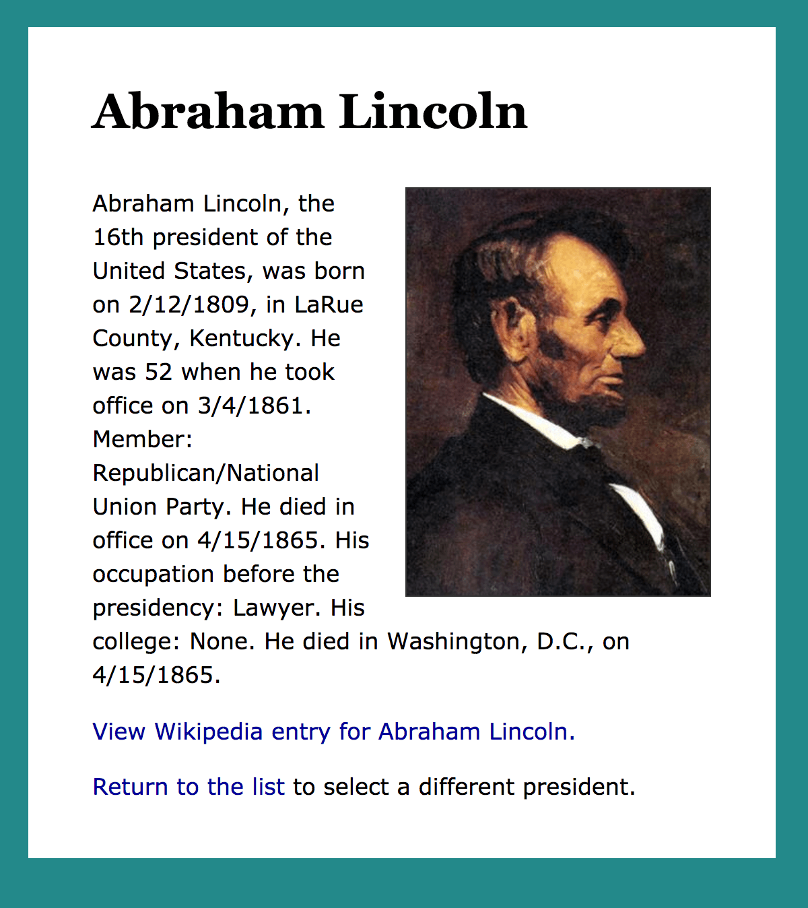

Flask Templates
===============

Previous:

1. `Flask intro <flask.html>`_: A very simple Flask app
2. `Flask, part 2 <flask2.html>`_: Values in routes; using an API

Code for this chapter is `here <https://github.com/macloo/python-adv-web-apps/tree/master/python_code_examples/flask>`_.

In the previous Flask chapters, we wrote some HTML directly into the Flask app script. This is very awkward. Naturally, Flask provides a better way to store the HTML (and CSS) you will want your Flask functions to generate.

Folder structure for a Flask app
--------------------------------

A proper Flask app is going to use multiple files — some of which will be template files. The organization of these files has to follow rules so the app will work. Here is a diagram of the typical structure: ::

    my-flask-app
       ├── static/
       │   └── css/
       │       └── main.css
       ├── templates/
       │   ├── index.html
       │   └── student.html
       ├── data.py
       └── students.py

1. Everything the app needs is in one folder, here named *my-flask-app*.

2. That folder contains two folders, specifically named *static* and *templates*.

   * The *static* folder contains **assets** used by the templates, including CSS files, JavaScript files, and images. In the example, we have only one asset file, *main.css*. Note that it’s inside a *css* folder that’s inside the *static* folder.

   * The *templates* folder contains only templates. These have an ``.html`` extension. As we will see, they contain more than just regular HTML.

3. In addition to the *static* and *templates* folders, this app also contains ``.py`` files. Note that these must be *outside* the two folders named *static* and *templates*.

.. attention:: The templates will not work if this folder structure is not exactly as described above. Your app folder can be named anything (not only *my-flask-app*), but the *static* and *templates* folders must be named and organized as shown above.

Get started with templates
--------------------------

Let’s first imagine a situation where we are going to need a lot of pages that all have the same layout.

For example, we might want to build an app that includes all the U.S. presidents. Each president will have their own page, like this:

We do not want to build 45 pages by hand. We happen to have all the presidential data `in a spreadsheet <https://github.com/macloo/python-adv-web-apps/blob/master/python_code_examples/flask/presidents/presidents.csv>`_. Can we make *one HTML template* and be done?

Yes!

Here is an excerpt from that template: ::

    <h1>{{ pres['President'] }}</h1>

    
{{ pres['President'] }}, the {{ ord }} president of the
       United States, was born on {{ pres['Birth-date'] }}, in
       {{ pres['Birthplace'] }}. He was {{ pres['Age-when-took-office'] }}
       when he took office on {{ pres['Took-office'] }}. Member:
       {{ pres['Party'] }} Party.

That might look slightly intimidating, but notice that inside each double-pair of curly braces is a **key** (in square brackets) that tells you exactly which information item will appear there. So, for Lincoln:

   *Abraham Lincoln, the 16th president of the United States, was born on 2/12/1809, in LaRue County, Kentucky. He was 52 when he took office on 3/4/1861. Member: Republican/National Union Party.*

How does a Flask app use a template?
++++++++++++++++++++++++++++++++++++

In the previous chapter, `Flask, part 2 <flask2.html>`_, you saw this route function: ::

    @app.route('/user/<name>')
    def user(name):
        personal = f'<h1>Hello, {name}!</h1>'
        instruc = '
Change the name in the <em>browser address bar</em> \
            and reload the page.
'
        return personal + instruc

Let’s transform that so it uses a template.

1. Put the HTML into a template: ::

    <h1>Hello, {{ name }}!</h1>

    
Change the name in the <em>browser address bar</em>
        and reload the page.

2. Save the template file as *hello.html* in the *templates* folder.

3. Edit the route function. Remove the HTML. Change the return statement — call the ``render_template`` function. That is how we get the template! ::

    @app.route('/user/<name>')
    def user(name):
        return render_template('hello.html', name=name)

4. We must import the ``render_template`` module, so add it to the line at the top of the Flask app script: ::

    from flask import Flask, render_template

.. note:: The template needs to be a complete HTML file, with all the usual elements such as HTML, HEAD, and BODY. See the complete example below.

.. literalinclude:: ../python_code_examples/flask/first_template_ex/templates/hello.html
   :caption:
   :language: html

.. attention:: In the HEAD above, in the LINK element, note the syntax for linking to a file in the *static* folder. The CSS file is just a normal CSS file, but it must be in the *static* folder for the Flask app.

`View the live “hello” app here. <https://first-baby-flask-app.herokuapp.com/>`_

`All the “hello” app’s files are here. <https://github.com/macloo/python-adv-web-apps/tree/master/python_code_examples/flask/first_template_ex>`_

How are variables passed from app to template?
++++++++++++++++++++++++++++++++++++++++++++++

name in hello app

pres['President'] in presidents app

dictionary

Resources
---------

* `Jinja documentation <https://jinja.palletsprojects.com/en/2.11.x/templates/>`_ — All the commands for the Jinja template syntax are here.

.
