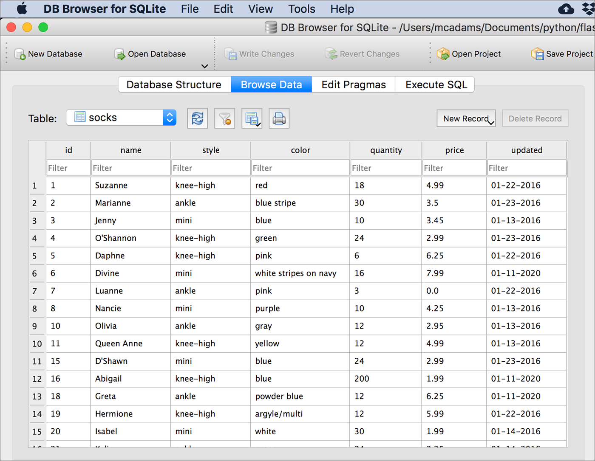
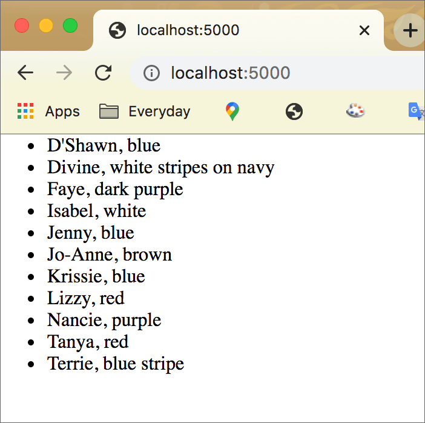

Flask: Read from a Database
===========================

It is essential to get your **database connection** working without errors before you try to do more with the database and Flask.

* Refer to `the previous chapter <flask_db1.html>`_ to test your database connection.

In this chapter we focus on reading data from a SQLite database, using Flask-SQLAlchemy.

* `SQLAlchemy documentation <https://www.sqlalchemy.org/>`_
* `Flask-SQLAlchemy documentation <https://flask-sqlalchemy.palletsprojects.com/>`_
* `Code for this chapter <https://github.com/macloo/python-adv-web-apps/tree/master/python_code_examples/flask/databases>`_

The database
------------

The SQLite database used here is named *sockmarket.db.* It has only one table, named **socks.** It has seven fields: *id, name, style, color, quantity, price,* and *updated.* You will see the table name and the field names later, in the Python code. The image below is a screenshot from the `DB Browser for SQLite <https://sqlitebrowser.org/>`_, showing the top rows of the **socks** table.

First read
----------

Without templates or anything fancy, let’s attempt to read some data from the database and return it in the browser.

.. literalinclude:: ../python_code_examples/flask/databases/read_db_basic.py
   :linenos:
   :lines: 1-31
   :emphasize-lines: 21-29
   :caption:

Everything up to line 18 comes from the script explained `in the previous chapter <flask_db1.html#how-to-connect-a-database-to-a-flask-app>`_.

The model
+++++++++

Lines 21–29 provide a *model* so that Python can translate the **socks** table. It’s a Python class that inherits from the ``Model`` class from SQLAlchemy. (Remember, ``db`` refers to SQLAlchemy.) We could name the new class anything, but ``Sock`` makes sense because this table’s data is all about socks.

.. note:: `Python style <https://www.python.org/dev/peps/pep-0008/#class-names>`_ dictates that a **class** starts with an uppercase letter and uses `camelCase <https://www.computerhope.com/jargon/c/camelcase.htm>`_. Using uppercase (as in **Sock** here) helps us recognize when a class is being used in Python.

If your database has *more than one table,* you will need to create an additional class like this for each additional table.

Note the following in the highlighted class above:

* Identify the primary_key field as shown (line 23).
* Write the field names *exactly* as they appear in the table.
* In ``__tablename__ = 'socks'``, note that the name of the table is case-sensitive. Match it to your actual table’s name.
* ``String``, ``Integer`` or ``Float`` must match the data type in your fields.
* Include *every* field in the table.

`See all possible data types here. <https://flask-sqlalchemy.palletsprojects.com/en/2.x/models/#simple-example>`_

The query in the route
++++++++++++++++++++++

We will provide only one route to start with, and it includes a try/except just like the example `in the previous chapter <flask_db1.html#how-to-connect-a-database-to-a-flask-app>`_.

.. literalinclude:: ../python_code_examples/flask/databases/read_db_basic.py
   :linenos:
   :lines: 31-49
   :lineno-start: 31
   :emphasize-lines: 6,11
   :caption:

The only code that “talks” to the database is in line 36.

1. ``socks`` is a new variable. We assign to it the data we are pulling from the database.
2. ``Sock.query`` refers to the class we built, Sock, starting on line 21. We are querying the table specified in that class.
3. ``.filter_by()`` limits what we’re asking for. It’s the ``WHERE`` clause in regular SQL.
4. ``style='mini'`` —  in this table, ``style`` is a field name. ``'mini'`` is a *value* in that field (column). So we will get only socks with the style “mini” — not “knee-high,” “ankle,” or “other.”
5. ``order_by()`` selects a field (column) to determine the *order* of the results listing. This is optional. Any field could be used.
6. ``Sock.name`` refers to the property ``name`` in the Sock class.
7. ``.all()`` is tacked onto the end of every query, unless you expect or want only one record to be returned — in which case, use ``.first()`` instead.

The default for ``order_by()`` is *ascending.* To sort by a column in *descending* order: ::

    from sqlalchemy import desc
    Sock.query.filter_by(style='mini').order_by( desc(Sock.price) ).all()

Lines 37–40 create a string using the data in ``socks`` and adding HTML tags around the data — the ``<ul>`` and ``<li>`` tags should be familiar to you.

After the for-loop completes, and the final closing tag ``</ul>`` is concatenated to the string, ``sock_text``, and the final string will be:

.. code-block:: html

    <ul><li>D'Shawn, blue</li><li>Divine, white stripes on navy</li><li>Faye, dark purple</li>
    <li>Isabel, white</li><li>Jenny, blue</li><li>Jo-Anne, brown</li><li>Krissie, blue</li>
    <li>Lizzy, red</li><li>Nancie, purple</li><li>Tanya, red</li><li>Terrie, blue stripe</li></ul>

Assuming that everything worked, that string is what will be **returned** (line 41).

The rest of the code (lines 42–49) is from `the database intro chapter <flask_db1.html#how-to-connect-a-database-to-a-flask-app>`_.

When the script runs, this is the result in the browser:

We have successfully queried data from this database and used it in a Flask route.

Now we will put it into a Flask template.

Add a template
--------------

Using a Flask template, we can make the list of socks display more beautifully:

.. figure:: _static/images/socks_list_template.png
   :alt: Socks list in templated page screenshot

Here is the central section of the HTML template that will display the socks. Instead of using an HTML list with ``<ul>`` and ``<li>`` tags, we’re using the standard HTML table tags with **Bootstrap** styles applied.

.. literalinclude:: ../python_code_examples/flask/databases/flask_db_read/templates/list.html
   :linenos:
   :lines: 22-48
   :lineno-start: 22
   :emphasize-lines: 4,18,26
   :caption:

Refer to the `Flask: Web Forms <flask_forms.html>`_ chapter for details about adding Bootstrap to Flask. Refer to the `Flask Templates <flask3.html>`_ chapter for details about working with templates.

`The entire app, including its templates and the database file, is here. <https://github.com/macloo/python-adv-web-apps/tree/master/python_code_examples/flask/databases/flask_db_read>`_

The previous route
++++++++++++++++++

Our first working route with **no template** was this: ::

    @app.route('/')
    def index():
        try:
            socks = Sock.query.filter_by(style='mini').order_by(Sock.name).all()
            sock_text = '<ul>'
            for sock in socks:
                sock_text += '<li>' + sock.name + ', ' + sock.color + '</li>'
            sock_text += '</ul>'
            return sock_text
        # lines omitted here

Note that the **database query** is the same below, in the new route that *uses a Flask template.*

The new route
+++++++++++++

If you refer to the Jinja code in the **template** above, you will see that it requires a value for *style* — ``{{ style }}`` and the value ``socks`` — used in the for-loop. (Those lines are highlighted.)

In the ``render_template()`` function returned by this route (below), you can see that these values are **passed to the template.** ::

    @app.route('/inventory/<style>')
    def inventory(style):
        socks = Sock.query.filter_by(style=style).order_by(Sock.name).all()
        return render_template('list.html', socks=socks, style=style)

The one difference in the **database query** is that instead of getting only records for which the style is ``'mini'``, here the value for ``style`` comes from a route variable. This technique is covered in the `templates chapter <flask3.html>`_.

A different database query
--------------------------

If you’re familiar with SQL, you know there are many different kinds of queries we can write against a database. All of them can be constructed `one way or another <https://flask-sqlalchemy.palletsprojects.com/en/2.x/queries/>`_ with Flask-SQLAlchemy.

* Search on the `Query API page <https://docs.sqlalchemy.org/en/13/orm/query.html>`_ in the SQLAlchemy documentation when you need to work out the syntax for an unusual query.

As an example, let’s see how to get this result for the index page of the socks app:

.. figure:: _static/images/read_db_index_template.png
   :alt: Socks index template screenshot

We might know exactly which styles are available in this database — but what if we *don’t* know? What if we expect *new styles* to be added without warning? Then we cannot hard-code the style values into the page you see above. Someday there might be a fifth style. We need to extract the styles from the database itself.

.. literalinclude:: ../python_code_examples/flask/databases/flask_db_read/read_db.py
   :linenos:
   :lines: 35-42
   :lineno-start: 35
   :emphasize-lines: 6
   :caption:

Above is the route for the index (or starting page) of the app. It calls the template named *index.html,* which you can see in part below. But focus your attention on the **database query** in line 40.

* The ``with_entities()`` method restricts the columns returned to only the one(s) you want. In this case, we want *only* the **style** column.
* The ``distinct()`` method returns only unique values in the specified column.

Therefore, the contents of the new variable ``styles`` in line 40 above are one instance of each unique value in the **style** column. By passing ``styles`` to the template *index.html,* we can use those values to create a list of links.

.. literalinclude:: ../python_code_examples/flask/databases/flask_db_read/templates/index.html
   :linenos:
   :lines: 21-31
   :lineno-start: 21
   :caption:

Above is the HTML in the *index.html* template. The list ``styles`` came from the route, and we can loop over the list with a Jinja directive.

The URL value for ``href=`` must be encoded for Flask (line 29). This was covered in the templates chapter.

Both the ``href=`` value and the text that is linked use the same value from ``styles``. As we loop over ``styles``, the current record is ``s`` — so the value in the **style** column is accessed with ``s.style``.

The URL that executes the *other* route function in this app is: ::

    /inventory/<style>

You’ve seen `this kind of Flask route before <flask3.html#the-route-to-one-selected-president>`_: ::

    /president/<num>

The result of clicking *knee-high* on the index page is that this request is sent to the server, and this URL appears in the browser: ::

    localhost:5000/inventory/knee-high

Conclusion
----------

Reading from the database depends on being able to connect to the database in the first place.

After that is accomplished, you need to write a database query (in a Flask route function) that gets what you need from the database. This might be one record (part or whole), several records, or just values from one column in the database. If your database has more than one table, you might need to `write SQL joins <https://docs.sqlalchemy.org/en/13/orm/query.html#sqlalchemy.orm.query.Query.join>`_ to get what you need.

Values obtained from a database query are then passed to the Flask template, as explained in another chapter here. Values are used in a template file according to the Jinja template syntax.

.
