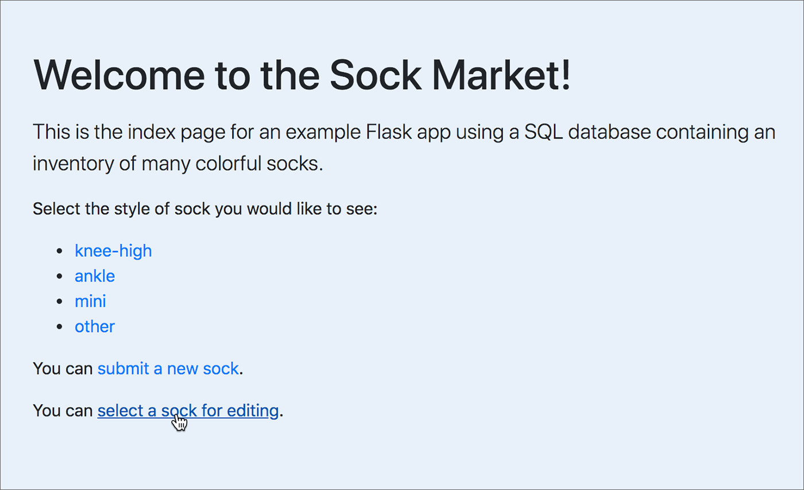
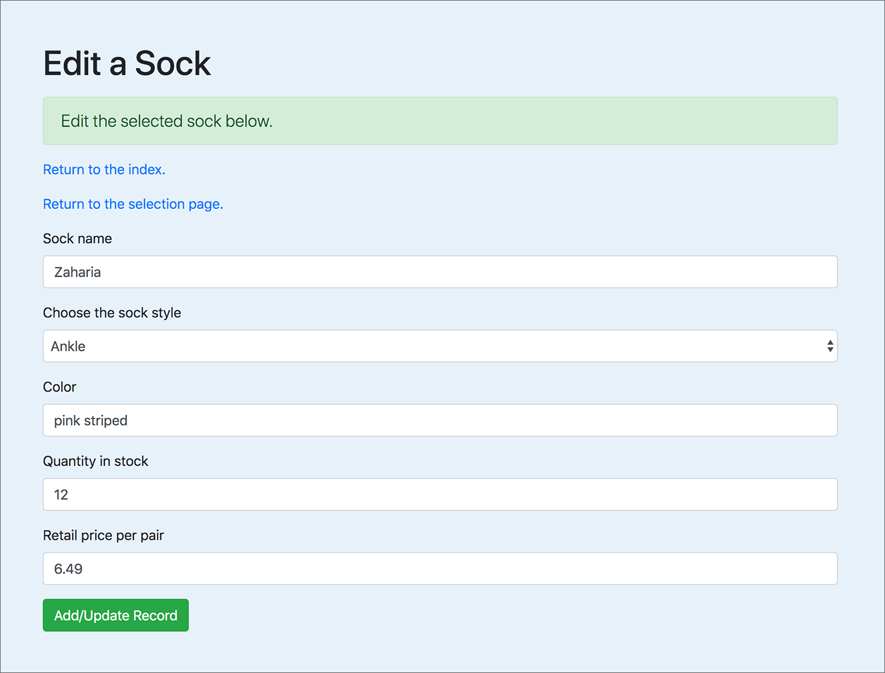

Flask: Write to a Database
==========================

In this chapter we focus on writing data to a SQLite database, using Flask-SQLAlchemy.

We will cover:

1. Add a new record: Create a complete new entry and add it to the database.
2. Update a record: Retrieve an existing record and allow the user to edit any part of it, then write the changes to the database.
3. Delete a selected record.

Resources:

* `SQLAlchemy documentation <https://www.sqlalchemy.org/>`_
* `Flask-SQLAlchemy documentation <https://flask-sqlalchemy.palletsprojects.com/>`_
* `Code for this chapter <https://github.com/macloo/python-adv-web-apps/tree/master/python_code_examples/flask/databases/flask_db_write>`_
* `Live version of the Flask app <https://weimergeeks.com/flask_db_write/>`_

The database
------------

We will use the same SQLite database from the chapter `Flask: Read from a Database <flask_db2.html>`_.

The database is named *sockmarket.db.* It has only one table, named **socks.** It has seven fields: *id, name, style, color, quantity, price,* and *updated.* You will see the table name and the field names later, in the Python code. The image below is a screenshot from the `DB Browser for SQLite <https://sqlitebrowser.org/>`_, showing the top rows of the **socks** table.

.. figure:: _static/images/socks_db_browser.png
   :alt: Socks table in DB Browser screenshot

It is essential to get your **database connection** working without errors before you try to do more with the database and Flask.

* Refer to `Flask and Databases <flask_db1.html>`_ to test your database connection.

Add new record to database
--------------------------

To add a new record to the database as part of a Flask app, you will likely use an HTML form similar to this:

.. figure:: _static/images/sock_entry_form_ss.png
   :alt: Add a new record form screenshot

The route: *localhost:5000/add_record*

Flask forms using **Flask-WTF** and **Flask-Bootstrap4** were introduced in the chapter `Flask: Web Forms <flask_forms.html>`_. See `the code for this form <#the-form-without-validators>`_ below.

App setup
+++++++++

The example app we will build here begins with the app completed in the chapter about `reading from a database <flask_db2.html>`_. Now there will be a lot of *new imports* at the top of the app file:

.. literalinclude:: ../python_code_examples/flask/databases/flask_db_write/write_db.py
   :linenos:
   :lines: 1-31
   :caption:

* Line 5: new imports from Flask — ``request`` and ``flash``. You’ll see these in the first new route.
* Line 10: new form fields you have not seen before, because the form here has a lot more going on than the simple form in the introductory chapter.
* Line 11: new form validators to prevent unwanted values going into your database.
* Line 12: import to enable Python to insert a date automatically into your database.
* Line 17: required by WTForms; covered in the forms chapter.
* Everything else above was covered in previous chapters.

Database table setup
++++++++++++++++++++

.. literalinclude:: ../python_code_examples/flask/databases/flask_db_write/write_db.py
   :linenos:
   :lines: 32-52
   :emphasize-lines: 4,14
   :lineno-start: 32
   :caption:

Lines 35–43 were explained in the chapter about reading from a database. Lines 45–51 were not needed there, but *now we need them,* or we’ll get an error when we try to write a new record into this table in the database.

``__init__()`` is a reserved method in Python classes. It is called when an object is created from the class, to initialize the properties of the class. Here, it specifies that when we pass values into **a new record** in this table, **the order of the values** will be *name, style, color, quantity, price, updated.*  **Note** that the order matters! You’ll see this in the first new route. ``self`` represents the new instance of the class, and everywhere you see it, it needs to stay.

.. important:: If your app needs to write a new record into *more than one* table, you’ll need to set up each of those tables in this way also.

The form without validators
+++++++++++++++++++++++++++

As explained in the web forms chapter, we can vastly simplify **the template HTML** by defining every aspect of a form in a new class **in the app script.**

.. code-block:: python

    class AddRecord(FlaskForm):
        # id used only by update/edit
        id_field = HiddenField()
        name = StringField('Sock name')
        style = SelectField('Choose the sock style',
            choices=[ ('', ''), ('ankle', 'Ankle'),
            ('knee-high', 'Knee-high'),
            ('mini', 'Mini'),
            ('other', 'Other') ])
        color = StringField('Color')
        quantity = IntegerField('Quantity in stock')
        price = FloatField('Retail price per pair')
        # updated - date - handled in the route function
        updated = HiddenField()
        submit = SubmitField('Add/Update Record')

.. note:: Each different field type here was *imported* from **wtforms** at the top of the script file.

`See a list of all WTForms field types. <https://github.com/macloo/python-adv-web-apps/blob/master/python_code_examples/flask/forms/WTForms-field-types.csv>`_ Note that they are *case-sensitive.*

The following might be puzzling:

* ``choices=[]`` — required for a SelectField. Inside the square brackets are tuples. The first item in a tuple is the value for the database. The second item in a tuple is the text visible in the select menu. These pairs translate into lines like this in the HTML: ``<option value="ankle">Ankle</option>``
*  ``HiddenField()`` denotes an HTML form element: ``<input type="hidden">``. This kind of form element is used to pass values that should not be edited or even seen by users, such as a database primary key. `Learn more at MDN. <https://developer.mozilla.org/en-US/docs/Web/HTML/Element/input/hidden>`_

Everything else should be clear if you are familiar with regular HTML forms. Compare the code to `the screenshot of the form <#add-new-record-to-database>`_. The live page is ➡︎ `here <https://weimergeeks.com/flask_db_write/add_record>`_.

The form with validators
++++++++++++++++++++++++

Validators — also imported from **wtforms** — can get pretty complicated. They can do quite a lot to prevent bad values from being written to your database, though, so it’s worthwhile to learn how to use them.

Below is *the same form class* with the validators added. This is the class used in the example app.

`See a list of all WTForms validators. <https://github.com/macloo/python-adv-web-apps/blob/master/python_code_examples/flask/forms/WTForms-validators.csv>`_

.. code-block:: python

    class AddRecord(FlaskForm):
        # id used only by update/edit
        id_field = HiddenField()
        name = StringField('Sock name', [ InputRequired(),
            Regexp(r'^[A-Za-z\s\-\']+$', message="Invalid sock name"),
            Length(min=3, max=25, message="Invalid sock name length")
            ])
        style = SelectField('Choose the sock style', [ InputRequired()],
            choices=[ ('', ''), ('ankle', 'Ankle'),
            ('knee-high', 'Knee-high'),
            ('mini', 'Mini'),
            ('other', 'Other') ])
        color = StringField('Color', [ InputRequired(),
            Regexp(r'^[A-Za-z\s\-\'\/]+$', message="Invalid color"),
            Length(min=3, max=25, message="Invalid color length")
            ])
        quantity = IntegerField('Quantity in stock', [ InputRequired(),
            NumberRange(min=1, max=999, message="Invalid range")
            ])
        price = FloatField('Retail price per pair', [ InputRequired(),
            NumberRange(min=1.00, max=99.99, message="Invalid range")
            ])
        # updated - date - handled in the route function
        updated = HiddenField()
        submit = SubmitField('Add/Update Record')

* ``InputRequired()`` means the field cannot be left empty.
* ``Regexp()`` is used to provide a *regular expression,* which is a *pattern* the entered string needs to match. `Learn about regular expressions in Python. <https://docs.python.org/3/howto/regex.html>`_ The ``message=`` value inside the parentheses will appear if the pattern is not matched.
* ``Length()`` allows us to provide a minimum and maximum length for the string. It also provides a ``message=`` option.
* ``NumberRange()`` allows us to provide a minimum and maximum number for an integer or a float.

.. note:: Each different validator above was *imported* from **wtforms** at the top of the script file.

The route function
++++++++++++++++++

The route — like all the code shown above — is in the app script, *write_db.py.*

The route *add_record* renders a template that contains the web form discussed above. In the decorator we add ``methods=['GET', 'POST']`` because this template can legitimately open via a regular HTTP request (*get*) or via a request with form data attached to it (*post*).

The function has an if/else to handle **two different circumstances**:

1. The form on the page has been submitted, and the form data were all valid. (The ``validate_on_submit()`` function returns True.) In that case, we want to send the data to the database.
2. No data will be written to the database. That case actually has two possible conditions:

    a. The form has not yet been filled in and submitted.
    b. The form was submitted, but there is invalid data in one or more fields.

First we’ll look at what happens if the data are valid and are written to the database:

.. literalinclude:: ../python_code_examples/flask/databases/flask_db_write/write_db.py
   :linenos:
   :lines: 114-134
   :emphasize-lines: 4,19
   :lineno-start: 114
   :caption:

* Line 117: Using `the form class created above <#the-form-without-validators>`_, we create an *instance* of that form and assign it to the variable ``form1``.
* Line 118: The ``if`` clause runs if the form data were valid. That means we want to write the data to the database.
* Lines 119–123: Create new variables from the data received from the form.
* Line 125: Run a function to create a date string representing today’s date. Assign that string to the new variable ``updated``.
* Line 127: Using the `model class created above <#database-table-setup>`_ — ``Sock`` — we format the data in the manner expected by the database, following the order in the ``__init__`` function. Assign this to a new variable, ``record``.
* Lines 129–130: This is SQLAlchemy handling everything to securely write to the database. Note that the variable ``record`` is used in line 129. ``db.session.commit()`` is necessary to update your database.
* Line 132: Create a message to pass to the template. Note that this message *only exists if* the data were sent to the database.
* Line 133: Render the template, passing the message to it.

.. figure:: _static/images/submit_success.png
   :alt: Result of successful submit in browser screenshot

Above, the result of successfully writing to the database renders the template *without showing the form.* It displays the message, including the name of the sock just submitted.

**What happens if data in one or more form fields are invalid when the form is submitted?**

Recall that in `the form class <#the-form-with-validators>`_, *validators* were added to restrict what can be sent to the database.

.. figure:: _static/images/errors_in_form.png
   :alt: Result of unsuccessful submit in browser screenshot

Above, you can see the result of **invalid data** in two of the form fields. The user can correct the errors and submit the form again. Nothing will be written to the database until all fields contain valid data. This is handled in the second part of the route function — the *else* clause:

.. literalinclude:: ../python_code_examples/flask/databases/flask_db_write/write_db.py
   :linenos:
   :lines: 134-144
   :emphasize-lines: 10
   :lineno-start: 134
   :caption:

See the `Flask Flash Function Tutorial <https://pythonprogramming.net/flash-flask-tutorial/>`_ for details about using ``flash()`` and the for-loop in the code above.

Note that the *else* clause also runs if this page is freshly opened in the browser, with an empty form. In that case, the for-loop runs, but there are no errors — and so no ``flash()`` messages will appear on the page.

The form — ``form1`` — *must* be passed to the template in the return statement (line 143 above).

The template
++++++++++++

Because of the ``flash()`` messages, this template is a bit complicated.

The top part (lines 26–34) runs only if the data were just written to the database. This is the case where the form is not on the page and the **message** says the data have been submitted.

The *else* clause is discussed below.

.. literalinclude:: ../python_code_examples/flask/databases/flask_db_write/templates/add_record.html
   :language: html
   :linenos:
   :lines: 24-64
   :lineno-start: 24
   :emphasize-lines: 3,13,41
   :caption:

The key thing to notice in the *else* clause is that the form is displayed (line 62): ::

    {{ wtf.quick_form(form1) }}

Recall that ``form1`` was passed to the template **in the route function.**

Lines 49–58 handle the ``flash()`` messages that are written *if the form is submitted with invalid data.* The way this section of code works is explained in `this tutorial <https://pythonprogramming.net/flash-flask-tutorial/>`_.

If the page was just opened and the form is empty, unfilled, then there are no ``flash()`` messages.

Summary: Add new record
+++++++++++++++++++++++

While that probably seems like a lot, note that there are *one form, one route,* and *one template* used to create a new record and add it to the database.

The template *and the route* in this case handle BOTH the form before it has been submitted AND the submission of the form.

That will not be the same when we delete or update a database record in this app.

* `Code for this app <https://github.com/macloo/python-adv-web-apps/tree/master/python_code_examples/flask/databases/flask_db_write>`_
* `Live version of this app <https://weimergeeks.com/flask_db_write/>`_

Delete or update a record
-------------------------

In contrast to adding a new record, either deleting or editing an existing record requires your code to find a specific record that is already *in the database.* The record must be selected in a way that guarantees only one record will be selected.

In this app, the index page offers an option to select a sock for editing:

Above: */* — route; *index()* — function; *index.html* — template

The link opens a page showing socks listed alphabetically by name, with a radio button at left to allow selection of just one sock:

.. figure:: _static/images/select_sock.png
   :alt: Select record page screenshot

Above: */select_record/<letters>* — route; *select_record(letters)* — function; *select_record.html* — template

The **value** encoded in the radio button is the unique ID (the primary key) for the sock record in the database. For example: ::

    <tr>
        <td class="center-align"><input type="radio" name="id" value="44" required></td>
        <td>Evelyn</td>
        <td>black multi</td>

The form in the template *select_record.html* has this **action** attribute in the ``form`` tag: ::

    action="{{ url_for('edit_or_delete') }}"

As a result, **submitting that form** calls the route for the *edit_or_delete()* function:

.. literalinclude:: ../python_code_examples/flask/databases/flask_db_write/write_db.py
   :linenos:
   :lines: 154-164
   :lineno-start: 154
   :emphasize-lines: 6
   :caption:

The unique ID is used in the database query (line 159) to retrieve the selected record from the database.

.. note:: The difference between ending the database query with ``.first()`` is that it returns only one record, while ``.all()`` returns all matching records *as a list.* Do not try to loop over a result obtained with ``.first()``.

The template rendered by that route — *edit_or_delete.html* — includes an if/else to determine whether to show the form for **deleting** a record *or* the form for **updating** a record. It tests the value of the variable ``choice``, which came from the form (line 158) and is passed to the template (line 163). The precise record that was selected is retrieved from the database in line 159 (highlighted) and passed to the template in line 163.

If you chose to delete, this is what you’ll see:

.. figure:: _static/images/delete_record.png
   :alt: Delete record page screenshot

Above: */edit_or_delete* — route; *edit_or_delete()* — function; *edit_or_delete.html* — template

If you chose to edit, you’ll see the form with values filled in from the record that was retrieved from the database.:

Above: */edit_or_delete* — route; *edit_or_delete()* — function; *edit_or_delete.html* — template

If you opened that route without submitting the form:

.. figure:: _static/images/post_error.png
   :alt: Post error page screenshot

Above: */edit_or_delete* — route; *edit_or_delete()* — function; *edit_or_delete.html* — template

.. important:: All of the three previous screenshots come from the same route, */edit_or_delete.* The template determines whether to show “Delete a Sock” or “Edit a Sock” based on the value of the variable ``choice``. The third screenshot is an error template (*error.html*) that renders automatically if the HTTP request was *get* and not *post* — because: ::

    @app.route('/edit_or_delete', methods=['POST'])

Deleting
++++++++

By submitting the deletion form that appears in the *enter_or_delete.html* template, the user causes the deletion to occur. The **action** in the form is: ::

    action="{{ url_for('delete_result') }}"

And so this route function is called:

.. literalinclude:: ../python_code_examples/flask/databases/flask_db_write/write_db.py
   :linenos:
   :lines: 165-179
   :lineno-start: 165
   :emphasize-lines: 8,9
   :caption:

The record deletion is performed in lines 172–173. The unique ID for the record was obtained from the form. The record was retrieved from the database in line 170. A message will be passed to the template named *result.html* (line 175), and this is the result:

.. figure:: _static/images/deleted.png
   :alt: Deleted result page screenshot

Editing
+++++++

Alternatively, by submitting the edit/update form that appears in the *enter_or_delete.html* template, the user causes the record to be changed in the database. The **action** in the form is: ::

    action="{{ url_for('edit_result') }}"

And so this route function is called:

.. literalinclude:: ../python_code_examples/flask/databases/flask_db_write/write_db.py
   :linenos:
   :lines: 180-202
   :lineno-start: 180
   :emphasize-lines: 6,19
   :caption:

This is a bit more complicated than the deletion function, but recall the way we *added a new record,* at the start of this chapter. Note that we are in fact **using the same form** that we used there. We are validating the data in exactly the same way (the ``else`` clause following line 202 is practically the same).

In lines 187–191, we add the form data to ``sock`` — which contains the record retrieved from the database in line 185. However, we do not write the record back to the database *unless* the form data validates. This is also very similar to the way we *added a new record.* The most significant difference between this function and that one is that when we **add a new record** we use ``db.session.add(record)`` and **here, we do not.** We only commit the changes with: ::

    db.session.commit()

A message will be passed to the template named *result.html* (line 201), and this is the result:

.. figure:: _static/images/edited.png
   :alt: Edited result page screenshot

.. important:: Both route functions — the one for deleting a record AND the one for editing a record — render the same template, *result.html.*

Summary: Delete or update (and a diagram)
+++++++++++++++++++++++++++++++++++++++++

This is a lot, with three different forms and three different templates. Perhaps this diagram will help.

.. figure:: _static/images/flowchart.png
   :alt: Flowchart showing edit or delete process

Of course this is not the only way to build it — Flask gives us a lot of freedom to design templates and use routes whatever way is best for the application we need to build.

Conclusion & tips
-----------------

If you’re making changes to a database via a Flask app, you are likely to use HTML forms.

A key fact to remember is that if you use the WTForms/flask_wtf ``quick_form()``, you do not have a lot of options for that form outside the **class** you build in the Flask app. `See the documentation. <https://pythonhosted.org/Flask-Bootstrap/forms.html>`_

If you want **more flexibility,** you can encode a form like the two forms in the template *edit_or_delete.html* — both of those have values assigned to each field. `See the complete template here. <https://github.com/macloo/python-adv-web-apps/tree/master/python_code_examples/flask/databases/flask_db_write/templates/>`_

For even more flexibility, you can write the entire form from scratch, as seen in the template *select_record.html.* In that case, you do not need to build a Python class for the form.

If you do not assign an **action** to a form, it will call the same route again when you submit it. If you want it to call a *different* route, assign that route as the value of ``action=`` — using Jinja template syntax, like this: ::

    action="{{ url_for('edit_result') }}"

.. note:: It is always the **function name** as the argument for ``url_for()`` — *never* the template name. If the function is named differently from the route URL, be sure to use the function name.

When writing the decorator for a route, consider whether you need to assign ONLY the *post* method to it, or BOTH *post* and *get.* In the socks app, only one route requires both *post* and *get*: ::

    @app.route('/add_record', methods=['GET', 'POST'])

Three routes require only *post*: ::

    @app.route('/edit_or_delete', methods=['POST'])
    @app.route('/delete_result', methods=['POST'])
    @app.route('/edit_result', methods=['POST'])

The difference is this: for */add_record* the user needs to be able to open the unfilled form with a regular link. That is the *get* method — the default for every regular web page. But when a route runs **as the result of a form submission,** the method *post* is required, because only *post* can convey form data to the server as attached data (not visible in the browser address bar). The */add_record* route both opens the (empty) form and processes the form.

The other three routes listed above ONLY run when a form is posted. If you try to open those directly, you’ll see an error message.

.
