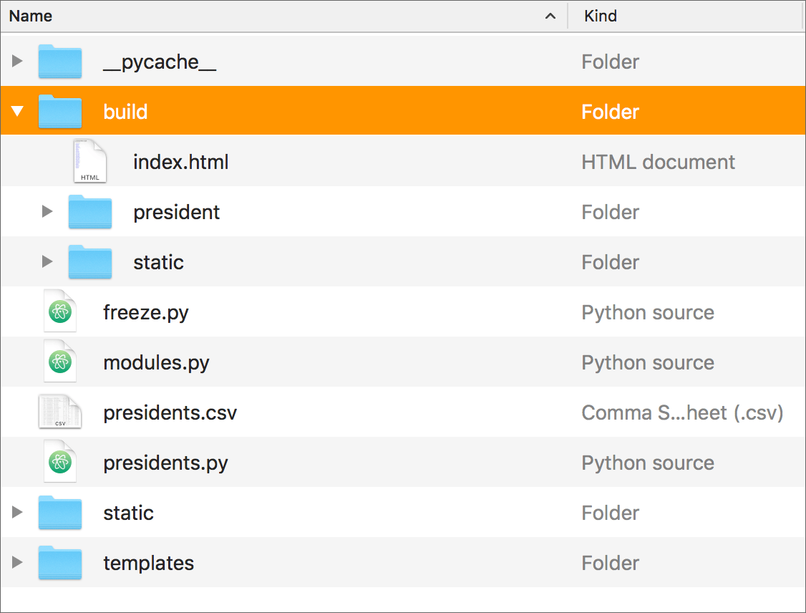

Flask: Deploy an App
====================

Previous:

1. `Flask intro <flask.html>`_: A very simple Flask app

2. `Flask, part 2 <flask2.html>`_: Values in routes; using an API

3. `Flask templates <flask3.html>`_: Write HTML templates for a Flask app

Code for this chapter is `here <https://github.com/macloo/python-adv-web-apps/tree/master/python_code_examples/flask>`_.

In the Flask Templates chapter, we built a functioning Flask app. In this chapter, we’ll explore several ways to put that Flask app online.

Introduction
------------

When professionals deploy their Python web apps, nowadays they commonly deploy to a cloud service such as `Amazon’s AWS <https://aws.amazon.com/>`_, `Heroku <https://www.heroku.com/>`_, or `Google App Engine <https://cloud.google.com/free/>`_.

One thing to understand, though, is that often they do not deploy a Python executable. That is, the site they upload to a web server is not the Flask app and its associated templates, etc., but rather a traditional website with hard-coded HTML files that has been *“baked out”* from Flask.

In this document, we’ll learn how to do that. Then we will also learn how to install a Flask app (one that has not been “baked out”) on `Render.com <https://render.com/>`_.

“Baking it out” with Frozen-Flask
---------------------------------

**Frozen-Flask** is a Flask extension, so we’ll need to install it. In Terminal, change into your Flask projects folder and **activate your virtual environment** there. Then install at the command prompt — where you see ``$`` (Mac) or ``C:\Users\yourname>`` (Windows )— ::

    pip install Frozen-Flask

After installing the extension, create **a new file** inside the folder that contains the Flask app you want to “freeze.” Name the new file *freeze.py* and copy/paste this script into it:

.. literalinclude:: ../python_code_examples/flask/freeze.py
   :caption:

.. warning:: ``filename`` in the script above must **OMIT** the file extension ``.py`` from the filename.

Save all your open files.

If the Flask web server is running, quit it with Control-C.

In Terminal, in the directory containing the Flask app, enter this at the command prompt: ::

    python freeze.py

**If freezing worked:** Inside your Flask app folder, you’ll now see a new folder named *build*. Open it. Inside *build*, you’ll see all the files created by Frozen-Flask.

The entire *build* folder can be uploaded to a web server (without any other files or folders), and the folder name can be changed (from *build* to anything) — and all the pages will work. (Just don't change or rename anything inside the *build* folder.)

Need to update the site? Make your edits, **run** *freeze.py* **again,** and re-deploy.

.. note:: If the generated HTML files do not have filenames ending with *.html,* they might not open in the browser locally. Upload the *build* folder to a server and test the pages there. `See an example! <https://weimergeeks.com/pres_frozen_build/>`_

Benefits of freezing
++++++++++++++++++++

Pause for a moment and consider this: Imagine you needed to build a site with detailed data about the 535 members of the U.S. Congress. You build it with Flask (using a CSV file, a Python dictionary, or an SQL database to generate all the data) with two or maybe three HTML templates. Then you run *freeze.py* and in seconds you have 535 individual files, which you just upload as one folder, and you’re done.

Similar apps might produce pages for:

* 190 pages for each dog breed in the American Kennel Club
* 318 pages for each character in all the Harry Potter novels
* 3,144 counties and county equivalents in the United States
* 6,909 living languages in the world

When there are changes to the data, you update the data source, re-freeze and re-deploy.

Freezer errors
++++++++++++++

**If freezing did not work:** This may happen because your app uses dynamic routes similar to this: ::

    @app.route('/actor/<id>')

You might need to add a `URL generator <https://pythonhosted.org/Frozen-Flask/#url-generators>`_ to the *freeze.py* file. **But read the NOTE above before you do this!**

For example (`see project files <https://github.com/macloo/python-adv-web-apps/tree/master/python_code_examples/flask/actors_app>`_): ::

    from data import ACTORS

    @freezer.register_generator
    def actor():
        for item in ACTORS:
            yield { 'id': item['id'] }

You can definitely freeze an app with dynamic route information, but you might need to play around with it a bit before you get it working.

Some apps *cannot* work via freezing. See below for details.

Read the `full documentation <http://pythonhosted.org/Frozen-Flask/>`_ for Frozen-Flask.

When freezing will not work, cannot work
----------------------------------------

If your app depends on dynamic activity — for example, if you are using **Flask-WTF** to process a form — you will not get a fully functioning app if you freeze it. Similarly, if you’re accessing an API to get data that changes frequently (such as currency rates or weather), you cannot freeze that app.

In those cases, you will need to have Python running on a web server — and NOT freeze the app.

There are various ways to do this if you pay to use a cloud service, but if you’re a student and your app is not going to attract thousands of users, there are some free options.

In the past, it was possible to run Python apps on hosted web server accounts (“shared hosting”) that provide **cPanel** — a set of services accessed from a simple dashboard. Unfortunately, this option is no longer available. A free option that is no longer offered was the “hobby” level of service at Heroku.

--- TEXT BELOW WILL BE EDITED OR REPLACED SOON ---

If you use the `GitHub Desktop app <https://desktop.github.com/>`_, you already have command-line ``git``. This is not part of Heroku, but **you will need to use** command-line ``git`` to *deploy to* Heroku.

Before proceeding with command-line ``git``, your Flask app should be ready to deploy (all code completed and tested). You must also complete these steps:

1. Install **Gunicorn**: You need to add a production-level web server to your web app. Heroku recommends `Gunicorn <https://gunicorn.org/>`_ for Python applications. Activate the virtualenv for your app and install it with: ::

    pip install gunicorn

2. Create or update *requirements.txt*: `Instructions are here. <http://bit.ly/python-reqs>`_ Even if you created a *requirements.txt* file earlier, you must re-create it to add **Gunicorn** to the list. **This is absolutely necessary.**

3. Make sure there is a *.gitignore* file in your repo and it excludes your *env/* or *venv/* folder. **You must NOT commit virtual environment files** — the *requirements.txt* file lists all the contents of your virtualenv so that it can be **re-created** on Heroku. `You can copy this file. <https://github.com/macloo/python-adv-web-apps/blob/master/.gitignore>`_

4. Create *Procfile*: This is a plain-text file that must be named exactly `Procfile` (uppercase P, and no file extension). Its contents declare which commands are run by the application’s dynos on Heroku. `Read more about Procfile here. <https://devcenter.heroku.com/articles/procfile>`_

To run a simple Python web app (such as the example *students-flask-app*), the complete contents of *Procfile* are: ::

    web: gunicorn students:app

**Database:** Note that Heroku prefers PostgreSQL and not MySQL or MariaDB. If your app includes a MySQL database, `read this <https://devcenter.heroku.com/articles/heroku-mysql>`_. The example app *students-flask-app* does not use any SQL database, so we can deploy it simply.

--- TEXT ABOVE WILL BE EDITED OR REPLACED SOON ---

Conclusion
----------

We’ve learned about two different options for deploying a Flask app:

* Use Frozen-Flask and then upload a folder to your server
* Deploy to Render.com

Depending on the characteristics of your Flask app, one of these options might be much better than the others, or they might all be equally suitable.

`See more options for deploying <https://flask.palletsprojects.com/en/2.2.x/deploying/>`_ in the Flask documentation.

.
