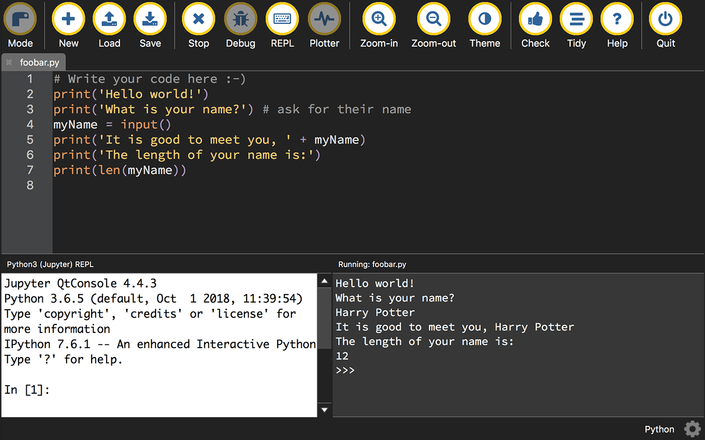

Starting Python
===============

To begin learning Python, read chapters 1 and 2 in Sweigart’s `Automate the Boring Stuff with Python <https://automatetheboringstuff.com/>`_ (second edition). Some scripts in this folder are based on Sweigart’s — naturally, he has more examples than only these. At his website, there’s a link to download files used in the book.

Interactively learning Python
-----------------------------

Start by running simple expressions and statements in the interactive Python interpreter (interactive shell). Open Terminal (Mac) or Command Prompt (Windows). Type ``python3`` (Mac) or ``python`` (Windows) at the prompt to start the interpreter. When you see ``>>>``, you're in the shell. This will help you get comfortable with variables and basic math operators: ::

    >>> fruit = 'apple'
    >>> print(fruit)
    apple
    >>> fruit = 'pear'
    >>> print(fruit)
    pear
    >>> 5 + 2
    7
    >>> sum = 5 + 2
    >>> print(sum)
    7

.. attention:: It’s very important to play with these simple statements and try things. Do not only type what is in the book or what you see here. Make up your own examples and try them. Type to understand how things work. If you don’t type the code yourself, you will not learn it.

Using Mu
--------

In his `Introduction <https://automatetheboringstuff.com/2e/chapter0/>`_, Sweigart recommends using the `Mu editing program <https://codewith.mu/en/about>`_, which you can download (free) for Mac or Windows.

If you are using Mu, you can type Python code interactively into the segment labeled “Python3 (Jupyter) REPL” *instead of* using Terminal or Command Prompt.

Saving Python scripts and running them
--------------------------------------

If you use Mu, you can write and save your Python scripts in the upper segment. When you run the script, the results will appear in the segment labeled “Running: filename.py.” Python scripts must end with a ``.py`` extension.

Instead of Mu, you can use `Atom <https://atom.io/>`_, our trusted code editor, to write and save your Python scripts. Code is code. You can write any code in Atom. Instead of saving the file with a ``.html`` or ``.js`` extension, just save it with a ``.py`` extension when it is a Python file.

If you write and save the file in Atom, how do you run it?

It’s easiest if you are in the same directory where the ``.py`` file was saved. Use the ``cd`` command (`Command Line Tips <http://bit.ly/mm-commandline>`_) to get there.

At the bash prompt, type this (using your actual filename, of course): ::

   python myfilename.py

And it runs! (Mac users: If not in a virtualenv, type ``python3`` instead of ``python``.)

Never try to run a file at the ``>>>`` shell prompt. You need to be at the bash prompt (``$``) in Terminal (Mac), or ``C:\Users\yourname>`` (Windows) to run a file.

Your first Python program
-------------------------

This is from Sweigart’s chapter 1 (pp. 11–13). After you’ve practiced basic expressions and variables in the interactive shell, you need to learn how to save a script as a file and run it.

.. literalinclude:: ../python_code_examples/learn_python/a_tiny_script.py

You can use Mu, or you can write the script in Atom and run it in the Terminal.

.. attention:: Make sure to note exactly *where* you save the ``.py`` file. You need to know where it is on your computer so that you can run it!

This interactive program says hello and asks for your name and age. It assigns your name and age to variables. It then uses the variables to print out strings, which will differ depending on what you responded.

These Python built-in functions are demonstrated in the interactive program:

- ``print()``
- ``input()``
- ``len()``
- ``int()``
- ``str()``

.. note:: All the code in the program is explained in Sweigart’s chapter 1.

Here’s what the program looks like in Atom:

.. figure:: _static/images/atom.png
   :scale: 50 %
   :alt: Python code in Atom screenshot

Here’s how I ran it in Terminal (note, I made a folder named ``automate`` for my files from the book):

.. figure:: _static/images/terminal.png
   :scale: 50 %
   :alt: Python 3 script running in Terminal screenshot

Code blocks and indentation
---------------------------

Python relies on consistent indentation of all code blocks. You need to pick a number of spaces (or use only tabs) and stick with it. Your code will throw errors if you are inconsistent.

.. literalinclude:: ../python_code_examples/learn_python/b_if_statements.py

Note how the indents are exactly the same for each code block.

.. tip:: When you run the code for an example, try entering many combinations and try to understand each result. For the script above, enter a name other than Alice and an age above 13, as well as *Alice* and an age below 13. By  entering different name and age values, you should be able to figure out how conditional statements work together.

Chapter review: chapters 1 and 2
--------------------------------

These are the takeaways from the first two chapters.

Chapter 1
+++++++++

1. Use the interactive Python shell to enter basic math expressions and get results (using the math operators)
2. Compare the output from ``23 / 7`` and ``23 // 7``
3. Exponents, e.g. ``2 ** 4``
4. Order of operations: `PEMDAS <https://www.mathsisfun.com/operation-order-pemdas.html>`_
5. Main data types: string, float, integer
6. String concatenation, e.g. ``'Alice' + 'Bob'``
7. String replication, e.g. ``'Alice' * 5``
8. Assign a value to a variable with ``=``
9. Rules for variable names: No spaces. Use only letters, numbers, and the underscore (``_``) character. Cannot begin with a number. Case sensitive. (p. 11)
10. Comments start with `#`
11. ``print()`` function
12. ``input()`` function — assign user input to a variable: ``answer = input()``
13. ``len()`` function
14. ``str()``, ``int()``, and ``float()`` functions — when we insert a numeral into a string, for example (pp. 15–18)

Chapter 2
+++++++++

1. The Boolean data type: ``True``, ``False``
2. Comparison operators, e.g. greater than, less than
3. Difference between ``==`` and ``=`` (what do they do?)
4. Boolean operators: ``and``, ``or``, ``not``
5. Conditions and blocks (pp. 27-28)
6. Flow control statements

   * ``if`` statements — they will evaluate to ``True`` or ``False``
   * ``else`` and ``elif`` statements
   * ``while`` loops
   * ``break`` statements
   * ``continue`` statements
   * ``for`` loops with ``range()``

7. Press Control-C to break out of an infinite loop
8. What *is* an infinite loop?
9. “When used in conditions, ``0``, ``0.0``, and ``''`` (the empty string) are considered False, while all other values are considered True.” (Truthiness, p. 43)
10. The ``random`` module, from Python’s standard library
11. Use of the ``import`` statement
12. Use of ``random.randint()``

Slides: chapters 1 and 2
++++++++++++++++++++++++

`Python Review 1 <http://bit.ly/pythonrev1>`_
