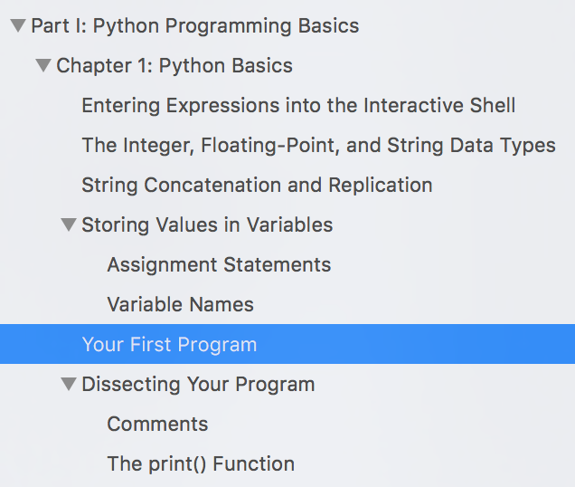

Starting Python
===============

To begin learning Python, read chapters 1 and 2 in Sweigart's `Automate the Boring Stuff with Python <https://automatetheboringstuff.com/>`_ (second edition). Some scripts in this folder are based on Sweigart’s — naturally, he has more examples than only these. At his website, there’s a link to download files used in the book.

Interactively learning Python
-----------------------------

Start by running simple expressions and statements in the interactive Python interpreter (interactive shell). Open Terminal (Mac) or Command Prompt (Windows). Type ``python3`` (Mac) or ``python`` (Windows) at the prompt to start the interpreter. When you see ``>>>``, you're in the shell. This will help you get comfortable with variables and basic math operators: ::

    >>> fruit = 'apple'
    >>> print(fruit)
    apple
    >>> fruit = 'pear'
    >>> print(fruit)
    pear
    >>> 5 + 2
    7
    >>> sum = 5 + 2
    >>> print(sum)
    7

.. attention:: It’s very important to play with these simple statements and try things. Do not only type what is in the book or what you see here. Make up your own examples and try them. Type to understand how things work. If you don’t type the code yourself, you will not learn it.

Using Mu or using Atom
----------------------

In his `Introduction <https://automatetheboringstuff.com/2e/chapter0/>`_, Sweigart recommends using the `Mu editing program <https://codewith.mu/en/about>`_, which you can download (free) for Mac or Windows.

.. figure:: _static/images/mu_editor.png
   :scale: 50 %
   :alt: Python 3 script running in Mu the editor screenshot

If you are using Mu, you can type Python code interactively into the segment labeled “Python3 (Jupyter) REPL” **instead of** using Terminal or Command Prompt.

Until about halfway through chapter 1, Sweigart has us using the interactive Python interpreter, as seen above. Then he switches to writing a program in a file, which he assumes we will run in IDLE. However, we write our code in `Atom <https://atom.io/>`_ and run it in Terminal (Mac) or Command Prompt (Windows).

Do not use IDLE to run your scripts
-----------------------------------

Instead, you can use `Atom <https://atom.io/>`_, our trusted code editor. Code is code. You can write any code in Atom. Instead of saving the file with a ``.html`` or ``.js`` extension, we save it with a ``.py`` extension when it is a Python file.

Then, how do you run it? Never try to run a file at the ``>>>`` prompt. You need to be at the bash prompt (``$``) in Terminal, or the Command Prompt if you’re using Windows.

It’s easiest if you are in the same directory where the ``.py`` file was saved. Use your ``cd`` command (`Command Line Tips <http://bit.ly/mm-commandline>`_) to get there.

At the bash prompt, type this (using your actual filename, of course): ::

    python3 myfilename.py

And it runs!

Here’s where that comes in the chapter:

Here’s what the program looks like in Atom:

.. figure:: _static/images/atom.png
   :scale: 50 %
   :alt: Python code in Atom screenshot

Here’s how I ran it in Terminal (I made a folder named ``automate`` for my files from the book):

.. figure:: _static/images/terminal.png
   :scale: 50 %
   :alt: Python 3 script running in Terminal screenshot

.. literalinclude:: ../python_code_examples/starting_from_scratch/a_tiny_script.py
   :lineno-start: 13

Chapter review: chapters 1 and 2
--------------------------------

These are the takeaways from the first two chapters.

Chapter 1
+++++++++

1. Use the interactive Python shell to enter basic math expressions and get results (using the math operators)
2. Compare the output from ``23 / 7`` and ``23 // 7``
3. Exponents, e.g. ``2 ** 4``
4. Order of operations: `PEMDAS <https://www.mathsisfun.com/operation-order-pemdas.html>`_
5. Main data types: string, float, integer
6. String concatenation, e.g. ``'Alice' + 'Bob'``
7. String replication, e.g. ``'Alice' * 5``
8. Assign a value to a variable with ``=``
9. Rules for variable names: No spaces. Use only letters, numbers, and the underscore (``_``) character. Cannot begin with a number. Case sensitive. (p. 11)
10. Comments start with `` # ``
11. ``print()`` function
12. ``input()`` function — assign user input to a variable: ``answer = input()``
13. ``len()`` function
14. ``str()``, ``int()``, and ``float()`` functions — when we insert a numeral into a string, for example (pp. 15–18)

Chapter 2
+++++++++

1. The Boolean data type
2. Comparison operators, e.g. greater than, less than
3. Difference between ``==`` and ``=`` (what do they do?)
4. Boolean operators — ``and``, ``or``, ``not``
5. Condition and block (p. 37ff) — blocks are indented
6. Flow control statements

   * ``if`` statements — they will evaluate to ``True`` or ``False``
   * ``else`` and ``elif`` statements
   * ``while`` loops
   * ``break`` statements (p. 49)
   * ``continue`` statements (p. 50)
   * ``for`` loops with ``range()``

7. Press Control-C to break out of an infinite loop
8. What is an infinite loop?
9. “When used in conditions, ``0``, ``0.0``, and ``''`` (the empty string) are considered False, while all other values are considered True.” (Truthiness, p. 53)
10. The ``random`` module, from Python’s standard library
11. Use the ``import`` statement to import this module
12. Use ``random.randint()``

Slides
++++++

`Python Review 1 <http://bit.ly/pythonrev1>`_
