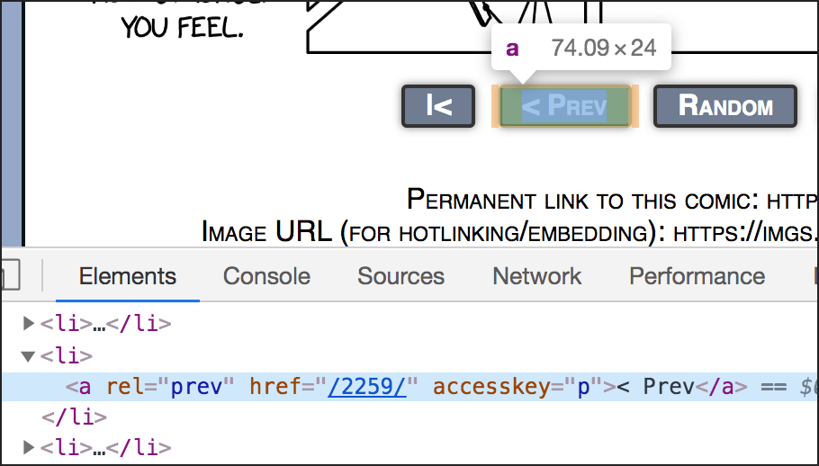

Web Scraping, Part 2
====================

You have installed **BeautifulSoup** (bs4) and tried some basic scraping.

If you have not yet installed the `Requests <https://requests.readthedocs.io/en/master/>`_ module, do it now (in your virtual environment). ::

    pip install requests

If you have not made a virtual environment yet, see `these instructions <http://bit.ly/install-python3-jupyter>`_.

`The code for this chapter is here. <https://github.com/macloo/python-adv-web-apps/tree/master/python_code_examples/scraping>`_

Using ``select()`` instead of ``find()`` or ``find_all()``
----------------------------------------------------------

In `the previous section <scraping.html>`_ we covered several commonly used commands for scraping with BeautifulSoup: ::

    soup.h1.text
    soup.find_all( "td", class_="city" )
    soup.find_all("img")
    soup.find(id="call")

In chapter 12 of `Automate the Boring Stuff with Python <https://automatetheboringstuff.com/>`_ (second edition), the author covers another command, the ``select()`` method.

This method might hold special appeal to people used to working with JavaScript, because the syntax for targeting HTML elements — inside the parentheses of ``select()`` — follows the same syntax as this commonly used JavaScript method: ::

    document.querySelectorAll()

So instead of ``( "td", class_="city" )``, we would write ``( "td.city" )``, and instead of ``(id="call")``, we would write ``("#call")``.

Note that ``select()`` *always* returns a list, even when only one item is found.

Be mindful that the way you write out what you’re looking for depends on whether you are calling ``select()`` or you are calling ``find()`` or ``find_all()``. You’ll get errors if you mix up the syntax.

Working with lists of Tag objects
---------------------------------

Both ``find_all()`` and ``select()`` always return a Python list. Each item in the list is a BeautifulSoup **Tag object.** You can access any list item using its index — just as you would with any normal Python list.

Try this code in the Python interpreter: ::

    from bs4 import BeautifulSoup
    import requests
    url = "https://weimergeeks.com/examples/scraping/example1.html"
    page = requests.get(url)
    soup = BeautifulSoup(page.text, 'html.parser')
    images = soup.select('img')
    print(images)

You’ll see that you have a **list** of IMG elements.

You can call ``.get_text()`` or ``.text`` on a Tag object to get only the text inside the element. To get the text from *just one* Tag object in a list, use its **list index**: ::

    cities = soup.select('td.city')
    print(cities[0])
    print(cities[0].text)

To get the text from *all the items* in the list, you need a for-loop: ::

    for city in cities:
        print(city.text)

If an element has **attributes,** you can get a Python **dictionary** containing all of them — again, use an index to see just one item from the list: ::

    images = soup.select('img')
    print( images[0].attrs )

To get a particular attribute for all the IMG elements, you need a for-loop: ::

    for image in images:
        print( image.attrs['src'] )

Another way to get a particular attribute is with ``.get()``: ::

    for image in images:
        print( image.get('src') )

As you see, there are various ways to do the same thing with BeautifulSoup. If you find it confusing, choose one way and stick with it.

When in doubt, refer to the `BeautifulSoup documentation <https://www.crummy.com/software/BeautifulSoup/bs4/doc/>`_ — it’s all on one page, so search it with Command-F.

Finding inside a Tag object
---------------------------

The methods ``find()``, ``find_all()``, and ``select()`` work on Tag objects as well as BeautifulSoup objects (`types of objects are covered here <https://www.crummy.com/software/BeautifulSoup/bs4/doc/#kinds-of-objects>`_). Here is an example:

.. literalinclude:: ../python_code_examples/scraping/table_scrape.py
   :caption:
   :linenos:

Once we’ve got ``table`` out of ``soup`` (line 9 above), we can go on to find elements inside the Tag object ``table``. First we get a list of all rows (line 12). Then we can loop over the list of row objects (starting on line 15) and make a list of all table cells in each row (line 17). From that list, we can extract the contents of one or more cells. By printing ``cells[1].text`` (line 19), we will see a list of all Scottish monarchs in the first table on the page.

It’s as if we are taking apart a set of nested boxes. We go inside the table to get the rows. We go inside a row to get its cells.

.. note:: Using ``try`` / ``except`` in the script above enables us to skip over the header row of the table, where the HTML tags are ``th`` instead of ``td``.

Since `the Scottish monarchs page <https://en.wikipedia.org/wiki/List_of_Scottish_monarchs>`_ has multiple tables, the code above should be modified to get them all: ::

    tables = soup.find_all( 'table', class_='wikitable' )

And then we will need to loop through the tables: ::

    for table in tables:
        rows = table.find_all('tr')
        for row in rows:
            try:
                cells = row.find_all('td')
                # print contents of the second cell in the row
                print( cells[1].text )
            except:
                pass

Our set of nested boxes actually begins with the page. Inside the page are several tables. Inside each table, we find rows, and inside each row, we find cells. Inside the second cell in each row, we find the name of a king.

Moving from page to page while scraping
---------------------------------------

In chapter 12 of `Automate the Boring Stuff with Python <https://automatetheboringstuff.com/>`_ (second edition), Sweigart provides a script to scrape the XKCD comics website (“Project: Downloading All XKCD Comics”). The code in step 4, which is part of a longer while-loop, gets the URL from an element on the page that links to the previous comic. In this way, the script starts on the home page of the site, downloads one comic, and then moves to the previous day’s comic page and downloads the comic there. The script repeats this until all comics have been downloaded.

This method is often exactly what you need to scrape the data that you want.

The trick is to determine exactly **how to get the URL** that leads to the next page to be scraped.

In the case of the XKCD site, this code works: ::

    prevLink = soup.select('a[rel="prev"]')[0]
    url = 'https://xkcd.com' + prevLink.get('href')

The code ``select('a[rel="prev"]')`` gets all ``a`` elements on the page that contain the attribute ``rel`` with the value ``"prev"``. This code returns a **list,** so it’s necessary to use the list index ``[0]`` to get the first list **item.** If you inspect the HTML on any XKCD page with Developer Tools, you can find this A element.

The next line extracts the *value* of the ``href`` attribute from that A element and concatenates it with the base URL, ``https://xkcd.com``.

To understand this code better, you can run it in the Python shell. Here I have started on the page at https://xkcd.com/2260/ — ::

    >>> prevLink = soup.select('a[rel="prev"]')[0]
    >>> print(prevLink)
    <a accesskey="p" href="/2259/" rel="prev">&lt; Prev</a>
    >>> print( prevLink.get('href') )
    /2259/
    >>> url = 'https://xkcd.com' + prevLink.get('href')
    >>> print(url)
    https://xkcd.com/2259/
    >>>

Above, I have printed ``prevLink``, ``prevLink.get('href')``, and ``url`` so you can see exactly what is being extracted and used. Once the script has that last URL, the while-loop restarts and goes to that page — https://xkcd.com/2259/ — and downloads the comic from it.

.. important:: You must understand that every website is different, so probably no other website in the world has the same HTML as the XKCD website. However, many websites do have Previous and Next buttons. It is necessary to **inspect** the HTML and determine how to extract the next- or previous-page URL (or partial URL) from the HTML on the button.

Some websites use JavaScript to activate their Previous and Next buttons. In those cases, you will need to use the Selenium module to navigate while scraping. Selenium is covered in the next chapter.

Harvesting multiple URLs from one page
--------------------------------------

In some cases, you will want to get all the URLs from one page and save them in a file. You would then use another script to open them one by one and scrape multiple pages.

.. literalinclude:: ../python_code_examples/scraping/harvest_urls.py
   :caption:
   :linenos:

It is likely that you do not want header and footer links from the page. You need to inspect the HTML and ascertain what element holds the main text. For a Wikipedia article, there’s an ``id`` attribute with the value ``'mw-content-text'``, so that’s what we start with in line 24.

When we get all the ``a`` elements with ``links_list = article.find_all('a')`` (line 27), we are getting only the ``a`` elements that are inside the DIV element with ``id='mw-content-text'``.

Then we use a loop (lines 30–33) to look at each item in ``links_list``. We check if an ``href`` attribute exists in the item with this line — ``if 'href' in link.attrs:`` — and if there *is* an HREF, then we write the value of that HREF into the file (line 33).

The script above writes more than 1,400 partial URLs into a file.

As with the XKCD script in the previous section, we would concatenate a base URL with the partial URL in a scraping script: ::

    base_url = 'https://en.wikipedia.org'
    url = base_url + '/wiki/Blade_Runner'

It should be noted that the *harvest_urls.py* script collects a lot of partial URLs we would never want, such as internal anchors that link to parts of the same page — ``#cite_note-1`` and ``#Early_career``, for example. To prevent those from being written to the file, we could use: ::

    for link in links_list:
        if 'href' in link.attrs:
            # eliminate internal anchor links
            if link.attrs['href'][:6] == '/wiki/':
                # eliminate Wikipedia photo and template links
                if link.attrs['href'][6:11] != 'File:' and link.attrs['href'][6:14] != 'Template':
                    # write one href into the text file - \n is newline
                    myfile.write(link.attrs['href'] + '\n')

That is a bit clunky, but if you look up `how to slice strings with Python <https://docs.python.org/3/tutorial/introduction.html>`_ (Command-F search there for "Slice indices"), I think the code will make sense to you.

As a result, we have about 900 partial URLs instead of more than 1,400.

You will *always* need to inspect the HTML of a page to figure out how best to harvest URLs from *that* particular page.

.
