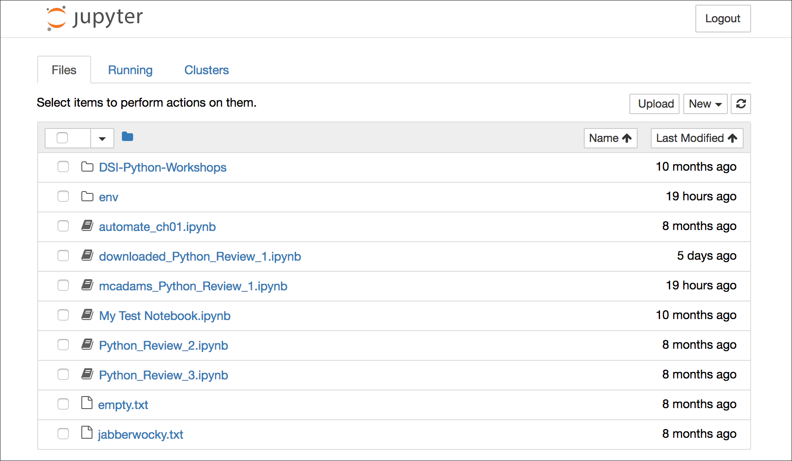

# Jupyter Cheat Sheet

We use [Jupyter Notebook](http://jupyter.org/) for several assignments with Python. This app allows us to write, run and store Python code in one interactive file that opens in a web browser.

We installed Jupyter in a Python virtual environment using these instructions:

[Install virtualenv and Jupyter](http://bit.ly/install-python3-jupyter)

We created the *virtual environment* in a folder named `jupyter_work` and installed Jupyter there.

All of that is done ONLY ONCE.

## To launch Jupyter Notebook

`cd` into the folder (e.g. `jupyter_work`) where you set that up.

**Activate** the *virtual environment* (at the command prompt).

MacOS:

```bash
source env/bin/activate
```

Windows:

```bash
env\Scripts\activate.bat
```

**Start** Jupyter Notebook (at the command prompt):

```bash
jupyter notebook
```

Everything else happens *in your web browser.* Choose the file you want to open from the list there. If the file isn’t there yet, you can use the Mac Finder or Windows File Explorer to drag it into the folder in the usual way.



*Above: The directory you were in when you launched Jupyter Notebook appears in your web browser.*

## To quit Jupyter Notebook

This is a two-step process. First you need to save and close your work in the web browser.

* To save your work, Command-S.
* To exit from the notebook, open the Jupyter **File** menu and select “Close and Halt.”
* Click LOGOUT in the upper right corner.

Then, in the Terminal, press **Control-C** &mdash; NOT Command.

Still in Terminal &mdash; type `y` (lowercase) and press Enter/Return.

## Quit from your virtual environment

**Deactivate** the *virtual environment* (at the command prompt):

```bash
deactivate
```
